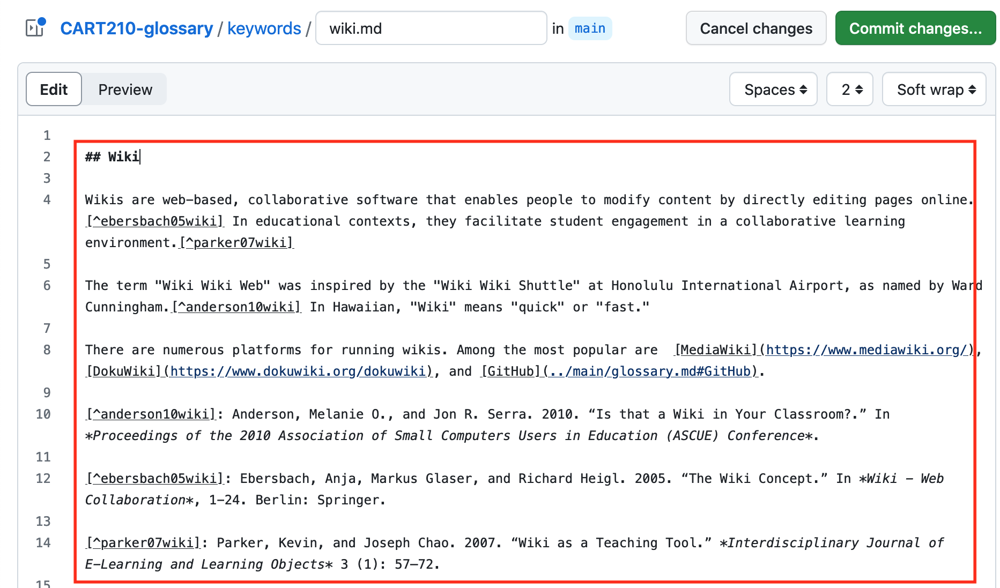

# CART210 New media glossary
This is the repository for the collaborative glossary of the New Media Theory(ies), Art, and Practice class.

## [Check the Glossary here](./glossary.md)

The glossary is constantly improved by the CART210 community throughout the term, with three sprint deadlines.

Each student must:

- define the concept in their own words, with precision and conciseness
- cite their sources of information in strict Chicago author-year format. Three references minimum per entry, and two of them must be from academic sources (i.e., book, article, or conference paper). Add your bibliographic entry at the end of the list, in the right alphabetic order.
- provide links in the form of internal references to other terms in the glossary
- provide links to external references in the form of HTTP links

## Adding new terms

- add the terms chosen as individual files inside the `keywords` folder of this repository
- if using the GitHub UI, contributors can create new files as shown in the image

- name each individual keyword file in lowercase and use the file extension `.md` (Markdown), as shown below

- add the details of the term they are working on using [strict Markdown syntax](https://docs.github.com/en/get-started/writing-on-github/getting-started-with-writing-and-formatting-on-github/basic-writing-and-formatting-syntax). The keyword title should be in Heading 2 (`## The term`) and the rest in plain markdown
- citations must be added in the same markdown file, as show below

To commit changes, each contributor will create a pull request using the [GitHub](../main/glossary.md#GitHub) web based interface. Contributors who know how to interact with [GitHub](../main/glossary.md#GitHub) using other environment (e.g., CLI or IDE), can also use those.

