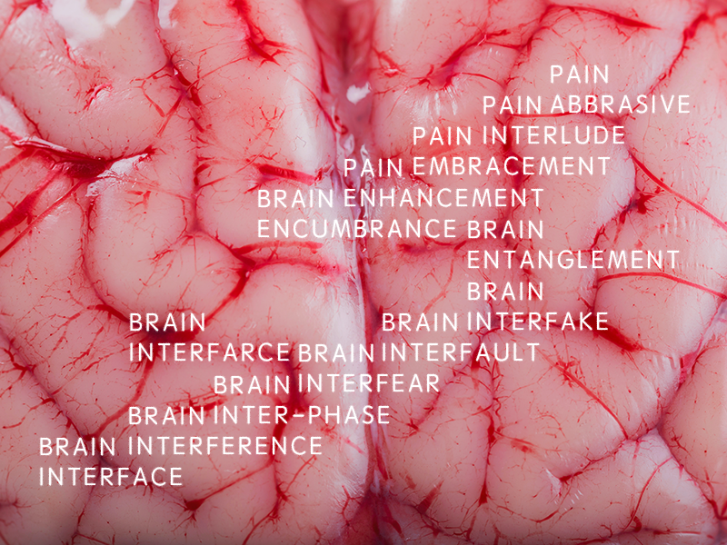

## Brain Interfaces

[^Angelsimon]

Brain Interfaces, also commonly called Brain-computer interfaces (BCIs) enables users to send messages or commands directly via brain activity, without movement. It is a communication system in which messages or commands of an individual sending it to the external world do not pass through the brain’s normal output pathways of peripheral nerves and muscles.[^GugerChris]

Brain-compiter interfaces raise and confront on level of philosophical and cultural questions to be asked. Initially, known in the realm of science fiction and popular movies, such as The Matrix(1999), the audiences has been confronted ot this idea of being connected via the brain/spine "plugged" to a virtual reality world or memory upload.[^CaldwellEverett]

In the view of Hayles, she engages with the facts that the body can be integrated with technology or without technology, but stands with the complexity of the material world: "If my nightmare is a culture inhabited by posthumans who regard their bodies as fashion accessories rather than the ground of being, my dream is a version of the posthuman that embraces the possibilities of information technologies without being seduced by fantasies of unlimited power and disembodied immortality, that recognizes and celebrates finitude as a condition of human being, and that understands human life is embedded in a material world of great complexity, one on which we depend for our continued survival."[^Hayles]

[^Angelsimon]: Simon, Angel. "Textura de un cerebro fresco de cordero". Education License - Adobe Stock. Assessed February 12, 2024. https://stock.adobe.com/ca/Library/urn:aaid:sc:VA6C2:82f1f676-07ac-428f-92d4-006bfcf3333e?asset_id=123121549.

[^GugerChris]: Guger, Christoph, Allison, Brendan Z., and Aysegul Gunduz. 2021. "Brain-Computer Interface Research: A State-of-the-Art". Brain-Computer Interface Research, SpringerBriefs in Electrical and Computer Engineering.

[^CaldwellEverett]: Everett, Anna, Caldwell, John T. 2003. "New Media: Theories and Practices of Digitextuality". Routelegde.

[^Hayles]: Hayles, Katherine. 1999. "How We Became Posthuman: Virtual Bodies in Cybernetics, Literature, and Informatics." University of Chicago Press.
