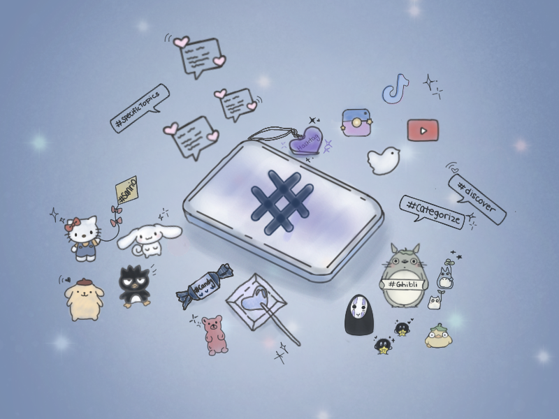

## Hashtag
A hashtag, denoted by the symbol “#”, is a metadata tag commonly use in the [Internet](../main/glossary.md#internet) culture, particularly on social media.[^Merriam-Webester24Hashtag] It originated as a feature on a post on Twitter in August 2007 from a product designer named Chris Messina. The primary purpose was to provide users with an easy way to categorize, discover and participate in specific topics on social media.[^Hastags.org12Whatis#] In addition, tweets containing hashtags can link to a specific timeline of other tweets with the same hashtag.[^WikströmHashtagOnTwitter] 

Hashtags are related to new media as it has significantly impacted the overall performance of social media content which can help small businesses, influencers, brands, and many more to reach a larger audience. A hashtag can contain multiple words without space, such as `#dogLover` and may also contain numbers. They can be added to social media posts, bios, comments, [blog](../main/glossary.md#blog) posts and other content. They are utilized across various platform, including Instagram, TikTok, YouTube, Facebook, Twitter and many more.[^SproutSocial23HashtagsWhatAreThey] [Users](../main/glossary.md#user) are also able to use emoji as hashtags on Instagram. They are mostly used to describe the content of the pictures, thereby increasing interaction.[^GiannoulakisTsapatsoulisPowerOfInstagram]  

By paying attention and researching trends, you can create a powerful tool to engage your audience and increase your social impact at no cost using hashtag. They can create a community where answers and questions can be freely exchange.[^OBrienDigitalMarketingInstitute] 

In addition, hashtags can be useful in assisting people in need and raising awareness about important issues. During the COVID-19 pandemic, Instagram hashtags helped young people at risk of poverty and social exclusion by fostering scientific education and promoting remote learning.[^PublicHealth22Instagram]

[^Merriam-Webester24Hashtag]: Merriam-Webster. 2024. “Hashtag.” https://www.merriam-webster.com/dictionary/hashtag. 

[^Hastags.org12Whatis#]: Hastags. 2012. “What is a (#) Hashtag?.” hashtags.org. https://www.hashtags.org/how-to/history/what-is-a-hashtag/.
	
[^SproutSocial23HashtagsWhatAreThey]: “Hashtags: What they are and how to use them effectively.” Sprout Social.  https://sproutsocial.com/insights/what-is-hashtagging/.

[^GiannoulakisTsapatsoulisPowerOfInstagram]: Giannoulakis, Stamatios, and Tsapatsoulis, Nicolas. 2016. “Evaluating the descriptive power of Instagram hashtags.” Journal of Innovation in Digital Ecosystems, Vol. 3, p.114-129. https://www.sciencedirect.com/science/article/pii/S2352664516300141?ref=pdf_download&fr=RR-2&rr=86fc3e901a046e02.

[^WikströmHashtagOnTwitter]: Wikström, Peter. 2014. "#srynotfunny: Communicative Functions of Hashtags on Twitter". SKY Journal of Linguistics, Vol. 27, p.127-152. https://www.linguistics.fi/julkaisut/SKY2014/Wikstrom.pdf.

[^PublicHealth22Instagram]: Aitor, Cañaveras, Gairal-Casadó, Regina, Gómez, Paula, Puigvert, Lídia, Sordé Martí, Teresa, and Villarejo-Carballido, Beatriz. 2022. "An Instagram Hashtag Fostering Science Education of Vulnerable Groups during the Pandemic." National Library of Medicine. https://www.ncbi.nlm.nih.gov/pmc/articles/PMC8872541/.

[^OBrienDigitalMarketingInstitute]: O’Brien, Clodagh. 2023. “How to Use Hashtags Effectively on Social Media.” Digital Marketing Institute. https://digitalmarketinginstitute.com/blog/how-to-use-hashtags-in-social-media#:~:text=A%20hashtag%20is%20a%20word,your%20posts%20and%20encourage%20interaction.
